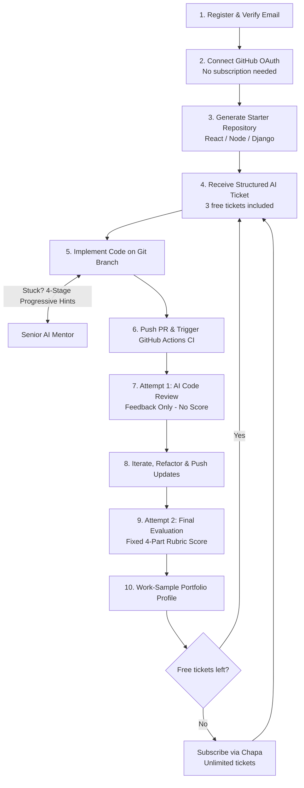
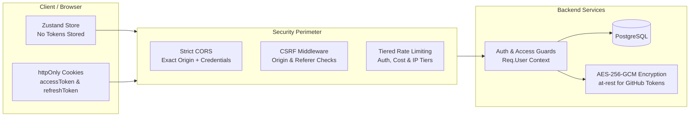

# 🚀 Work Simulator (WorkSim)

> **"Your first job before you get your first job."**  
> An enterprise-grade engineering simulation platform bridging the junior developer experience gap through realistic tickets, AI mentorship, real GitHub pull requests, automated CI verification, and multi-dimensional rubric evaluations.

---

[](https://github.com/Lab-Lynx/WorkSim/actions/workflows/backend-ci.yml)
[](https://github.com/Lab-Lynx/WorkSim/actions/workflows/frontend-ci.yml)
[](LICENSE)
[](https://www.typescriptlang.org/)
[](https://react.dev/)
[](https://expressjs.com/)
[](https://www.prisma.io/)
[](https://www.postgresql.org/)

---

## 🎯 The Core Problem & Why It Exists

### The Junior Developer Experience Paradox
Junior developers graduate from universities, bootcamps, and self-taught paths with fundamental coding skills. However, they face a crippling paradox: **companies require prior team experience to hire, but developers cannot gain team experience without being hired.**

Traditional education models create critical preparation gaps:
1. **No Real Codebase Context:** Learning occurs in vacuum-sealed greenfield tutorials or trivial algorithmic puzzles rather than complex existing codebases.
2. **Missing Engineering Workflows:** Junior developers rarely experience receiving structured Jira/Linear-style tickets, estimating tasks, navigating large file trees, or following branch naming standards.
3. **Absence of Senior Mentorship:** When stuck, developers either get stuck indefinitely or resort to copying full answers from ChatGPT/StackOverflow without developing diagnostic reasoning.
4. **No Pull Request or Code Review Exposure:** They have never opened a real Pull Request, navigated automated Continuous Integration (CI) test failures, or parsed critical senior engineer review feedback to submit iterative revisions.

### Why LeetCode & Coding Challenge Sites Fail
Platforms like LeetCode, HackerRank, and Codewars test isolated algorithmic puzzles inside browser-based JavaScript execution sandboxes. They fail to prepare engineers for professional software development because:
- Real engineering is **90% reading, modifying, and testing existing code**, not writing binary search algorithms from scratch.
- They lack git version control, multi-file modules, environment configurations, and dependency management.
- They do not cultivate communication, troubleshooting, or understanding business acceptance criteria.

---

## 💡 The Solution: Work Simulator

**Work Simulator** delivers an authentic, end-to-end simulated software engineering workplace where developers practice being on a real team before their first job.



### Free Trial & Subscription

Every account starts with a **free trial of 3 tickets**. You can try the whole loop before paying anything:

- **No subscription is needed to onboard.** Registering, connecting GitHub, creating your starter repository, working a ticket, using the AI mentor, and submitting pull requests are all available on the free trial.
- **The limit is 3 tickets in total, per account.** Every ticket ever assigned counts, **including abandoned ones**, so abandoning a ticket does not give you a replacement. Your remaining count is shown on the dashboard (for example, "2 of 3 free tickets left").
- **A subscription is only asked for when you request a 4th ticket.** The API then answers `402 Payment Required` and the app sends you to Chapa hosted checkout. Tickets you have already started can always be finished and submitted.
- **Subscribers get unlimited tickets** for the length of their paid period. Payments are confirmed by HMAC-verified Chapa webhooks, never by the browser redirect alone.

### Trying It Without Signing Up (Guest Login)

The login and register pages include a **Continue as guest** button that signs in to a pre-provisioned demo account, so reviewers can explore the product without creating an account. It is enabled only when the backend has `GUEST_LOGIN_EMAIL` and `GUEST_LOGIN_PASSWORD` set (see `backend/.env.example`); when they are unset the button is hidden. The guest account is an ordinary user, so it is subject to the same 3-ticket free trial.

### The Platform Loop
1. **Secure Onboarding:** Developers register and verify their email, then start immediately with 3 free tickets. A Chapa hosted-checkout subscription (cryptographically verified by webhooks) is only required to go beyond the free trial.
2. **Real GitHub Ecosystem Integration:** Connecting their real GitHub account via OAuth (available to free-trial users too) automatically generates an authentic repository from the starter template matching their stack (**React SPA**, **Node.js/Express API**, or **Django**), complete with configured GitHub Actions CI workflows.
3. **Structured AI Ticket Generation:** Tickets are not freeform hallucinations. The platform authors strict structural templates (target files, acceptance criteria, test checklists), and Google Gemini dynamically fills domain-specific scenarios. Every ticket is guaranteed to reference real files and be testable.
4. **Progressive Hint AI Mentor:** A senior engineer simulator designed to prevent cheating and develop problem-solving stamina. It enforces four sequential hint stages:
   - *Stage 1:* Diagnostic inquiry (*"What have you tried so far?"*)
   - *Stage 2:* Conceptual guidance (*"Consider how middleware ordering affects the request lifecycle."*)
   - *Stage 3:* File/function pointer (*"Look closely at `src/middlewares/auth.middleware.ts`."*)
   - *Stage 4:* Targeted actionable hint (*"Ensure your condition checks for null before reading properties."*)
5. **Real Pull Requests & Automated CI:** Developers create feature branches, commit code, and open real Pull Requests. Webhooks listen for GitHub Actions test run results.
6. **Dual-Pass Rubric Evaluation:**
   - **Submission 1 (Review):** The evaluator analyzes the git diff alongside GitHub Actions test results, issuing comprehensive line-by-line feedback without scores to stimulate real code revisions.
   - **Submission 2 (Final Score):** Re-review calculates a final grade based on a deterministic weighted rubric:
     - 🎯 **40% Requirements Met:** Fulfillment of acceptance criteria.
     - 🧪 **25% Correctness & Tests:** Code functionality and passing GitHub Actions CI suite.
     - 🎨 **20% Code Quality:** Maintainability, idiomatic patterns, and clean architecture.
     - 💬 **15% Problem Solving & Communication:** Mentor engagement depth and iterative debugging (anti-cheating signal).
7. **Verified Experience Profile:** A shareable, evidence-backed developer portfolio displaying resolved tickets, code diffs, CI test logs, and rubric score breakdowns.

---

## 🏗 System Architecture & Monorepo Design

Work Simulator is architected as an enterprise monorepo housing two decoupled, independent applications:

```text
work-simulator/
├── frontend/               # React 19 + Vite SPA (Client Portal)
│   ├── src/
│   │   ├── components/     # shadcn/ui + Radix primitives + domain layouts
│   │   ├── config/         # Zod-validated environment & app constants
│   │   ├── hooks/          # Custom hooks (session bootstrap, mutations)
│   │   ├── lib/            # Custom fetch API client, QueryClient, utilities
│   │   ├── pages/          # Lazy-loaded route views (auth, tickets, mentor)
│   │   ├── routes/         # React Router v7 route definitions & guards
│   │   ├── store/          # Zustand client UI & session stores
│   │   └── types/          # Shared domain & API contract types
│   ├── tests/              # Vitest + React Testing Library suites
│   └── package.json        # Frontend-specific scripts and dependencies
│
├── backend/                # Node.js + Express 5 + Prisma API
│   ├── prisma/             # PostgreSQL schema, migrations, and seed scripts
│   ├── src/
│   │   ├── config/         # Database pool, env validation, provider setup
│   │   ├── controllers/    # Thin HTTP request parsers & response shaping
│   │   ├── integrations/   # Gemini AI, Groq, Chapa, GitHub, Resend
│   │   ├── lib/            # Crypto (AES-256-GCM), scoring rubric engine
│   │   ├── middlewares/    # Auth, access guards, CSRF, rate-limiters, error
│   │   ├── routes/         # Express 5 endpoint routers
│   │   ├── schemas/        # Zod request validation schemas
│   │   ├── services/       # Core business logic & database transactions
│   │   ├── types/          # Backend domain, DTO, and Express extensions
│   │   └── utils/          # Token hashing, cookies, Pino logger, ApiError
│   ├── tests/              # Vitest unit and integration test suites
│   └── package.json        # Backend-specific scripts and dependencies
│
├── docs/                   # Full system architecture, API specs & test plans
├── .husky/                 # Root-level path-aware Git pre-commit & pre-push hooks
├── .github/workflows/      # Independent, path-filtered GitHub Actions CI pipelines
├── AGENTS.md               # Strict developer & AI coding behavioral rules
├── LICENSE                 # MIT Open Source License
└── package.json            # Monorepo root script orchestrator
```

### Architectural Isolation Principles
- **No Shared Node Modules:** `frontend/` and `backend/` maintain independent `package.json` and lockfiles. Dependencies are never hoisted or shared across runtime boundaries.
- **Path-Aware Git Hooks (Husky):** Root hooks trigger checks only on folders with staged changes. Committing a backend fix never waits on frontend tests, and vice versa.
- **Targeted CI Pipelines:** GitHub Actions workflows filter execution based on path triggers (`backend/**` vs `frontend/**`).

---

## 🛡️ Security Architecture

Work Simulator implements defense-in-depth across the entire application lifecycle:



### 1. Zero-Trust Cookie Authentication
- **Anti-XSS Protection:** Access and refresh tokens are strictly issued as `httpOnly` cookies. JavaScript cannot access tokens, completely eliminating token theft via Cross-Site Scripting (XSS).
- **Environment-Aware Flags:** `Secure` is enforced in production; `SameSite=Lax` for local development and `SameSite=None; Secure` across decoupled production domains.
- **Strict Cookie Path Scoping:** Access tokens are scoped to `/`, while refresh tokens are restricted to `/api/v1/auth`, minimizing exposure on standard API requests.

### 2. Single-Use Refresh Token Rotation & Revocation
- **SHA-256 Hashed Storage:** Raw refresh tokens are never stored in the database. Only their SHA-256 cryptographic hashes are recorded in the `RefreshToken` table.
- **Atomic Rotation:** Every refresh operation revokes the existing token (`revokedAt = now()`) and issues a new pair inside a database transaction. Reusing a revoked token triggers instant session revocation (breach detection).

### 3. Application-Level CSRF Defense
- Production cross-site cookies are protected by a dedicated `csrfMiddleware`.
- Every state-changing HTTP request (`POST`, `PUT`, `PATCH`, `DELETE`) carrying authentication cookies is validated to ensure its `Origin` or `Referer` strictly matches the configured `CLIENT_URL`.

### 4. At-Rest Token Encryption (AES-256-GCM)
- Third-party GitHub OAuth access tokens are encrypted before database persistence using authenticated **AES-256-GCM** with a random 12-byte initialization vector (IV) and authentication tag.

### 5. Concurrency Race Condition Protection
- Single-use verification and password reset tokens use atomic SQL conditional updates (`id` + `usedAt IS NULL`) within database transactions, preventing double-claim race attacks.

### 6. Tiered Multi-Level Rate Limiting
- **Default Limiter:** General traffic defense against DoS.
- **Auth Limiter:** Strict limits against brute-force credential stuffing.
- **Registration Limiter:** Limits rapid user creation.
- **AI & Cost Limiters:** Protects LLM budget by limiting ticket assignments, mentor conversations, and submission evaluation passes.

### 7. Idempotent Cryptographic Webhook Processing
- Webhook routes (`/webhooks/chapa`, `/webhooks/github`) preserve raw body byte streams ahead of standard JSON parsers to ensure exact **HMAC-SHA256 signature verification**.
- Idempotency is enforced by an atomic `(provider, eventKey)` unique constraint on `WebhookEvent`, neutralizing replay and double-billing attacks.

---

## ⚡ Performance & Efficiency Architecture

Work Simulator is optimized for low latency, high throughput, and cost-effective AI consumption:

### 1. Database & Query Optimization
- **Full Foreign-Key Indexing:** Every relational key (`userId`, `ticketId`, `submissionId`, `subscriptionId`) is indexed.
- **Partial & Compound Indexes:**
  - `Ticket_userId_active_key`: Guarantees exactly one active ticket per user at the database level.
  - `Subscription_userId_live_key`: Ensures single active subscription constraint.
  - Composite indexes `[userId, status]` and `[ticketId, createdAt]` optimize high-frequency list and message ordering queries.
- **Zero N+1 Query Patterns:** Services batch and include related relations in single queries rather than looping over database calls.
- **Database CHECK Constraints:** Attempt limits (`1` or `2`), score ranges (`0` to `100`), and rubric constraints are enforced natively in PostgreSQL.

### 2. High-Performance Connection Pooling
- Built on Node's native `pg.Pool` coupled with the `@prisma/adapter-pg` driver adapter.
- Optimized for serverless or pooled PostgreSQL providers (e.g., Supabase Transaction Pooler), with clean connection draining during graceful shutdown (`SIGTERM`/`SIGINT`).

### 3. Frontend Caching & State Separation
- **Server State (TanStack Query):** Automatic background refetching, query deduplication, garbage collection, and a default 5-minute stale-time.
- **Client State (Zustand):** Lightweight client-side stores strictly for UI state (sidebar, active modal, session hydration), keeping application memory lean.
- **Adaptive Single-Flight Token Refresh:** If multiple queries encounter a 401 simultaneously, a promise mutex (`refreshInFlight`) coalesces them into a single refresh call, preventing thundering herd refresh storms.

### 4. Code Splitting & Asset Optimization
- Dynamic route-level code splitting using `React.lazy()` and `Suspense` ensures users only load the JavaScript necessary for their active view.
- Tailwind CSS v4 provides compile-time utility generation with zero runtime overhead.

---

## 🛠 Tech Stack Summary

| Layer | Technologies |
|---|---|
| **Frontend** | React 19, TypeScript, Vite, Tailwind CSS v4, shadcn/ui, Radix UI, TanStack Query v5, Zustand, React Router v7, React Hook Form, Zod |
| **Backend** | Node.js, Express 5, TypeScript, Prisma ORM, PostgreSQL, bcrypt, jsonwebtoken, Pino, express-rate-limit, Helmet |
| **Integrations** | Google Gemini (AI Mentor & Ticket Generation), Groq / Llama (Evaluation Engine), GitHub REST/GraphQL API, Chapa Payments, Resend Email |
| **Tooling & CI** | Vitest, React Testing Library, ESLint, Prettier, Husky, lint-staged, Docker Compose, GitHub Actions |

---

## 🚀 Quick Start Guide

### Prerequisites
- **Node.js:** `>= 20.x` (or `>= 22.x` matching `.nvmrc`)
- **Docker & Docker Compose** (for PostgreSQL)
- **Git**

### 1. Clone & Install Dependencies
```bash
git clone https://github.com/Lab-Lynx/WorkSim.git
cd WorkSim

# Install monorepo root, frontend, and backend dependencies in one command
npm run install:all
```

### 2. Configure Environment Variables
Copy the example environment files in both applications:

```bash
# Backend configuration
cd backend
cp .env.example .env

# Generate high-entropy secrets for JWTs and encryption:
node -e "console.log(require('crypto').randomBytes(48).toString('hex'))"

# Frontend configuration (in a new terminal)
cd ../frontend
cp .env.example .env
```
*(Review each `.env.example` file for detailed explanations of required keys.)*

### 3. Launch Local Database & Run Migrations
From `backend/`:
```bash
# Start PostgreSQL container
docker compose up -d

# Generate Prisma client and apply database migrations
npm run prisma:generate
npm run prisma:migrate
```

### 4. Run Development Servers
From the repository root:
```bash
# Terminal 1: Backend API (http://localhost:3000)
npm run dev:backend

# Terminal 2: Frontend Client (http://localhost:5173)
npm run dev:frontend
```

---

## 📜 Monorepo Root Scripts

| Command | Action |
|---|---|
| `npm run install:all` | Installs root, `frontend/`, and `backend/` dependencies |
| `npm run dev:frontend` | Launches Vite frontend development server |
| `npm run dev:backend` | Launches Express backend with `tsx watch` hot-reload |
| `npm run lint:frontend` | Runs ESLint over frontend codebase |
| `npm run lint:backend` | Runs ESLint over backend codebase |
| `npm run test:frontend` | Executes frontend Vitest test suite |
| `npm run test:backend` | Executes backend Vitest test suite |

---

## 🗺️ Product Roadmap

| Feature Area | V1 (Current Release) | V2 (Near-Term) | V3 (Long-Term Vision) |
|---|---|---|---|
| **Starter Stacks** | React, Node/Express, Django | Vue, Next.js, Go, Python/FastAPI | Mobile, DevOps & Systems tracks |
| **GitHub Integration** | Real OAuth, repo creation & PR validation | Hardened branch policies & auto-tagging | Monorepo multi-service workflows |
| **AI Team Simulation** | Senior Mentor & Code Evaluator | QA Engineer & Engineering Manager | Full Virtual Team (Design, Product, DevOps) |
| **Voice Integration** | Out of scope | **Voxide** voice-driven workflow triggers | Real-time conversational standups |
| **Developer Signal** | Work-sample portfolio with diffs & rubrics | Shareable public profiles & daily ticket pacing | Direct employer hiring pipelines |

---

## 🤝 Contributing & Quality Standards

1. Create a feature branch off `main`: `type/short-description` (e.g. `feat/mentor-hint-stages`).
2. Adhere strictly to the backend layering and security rules outlined in **[`AGENTS.md`](AGENTS.md)**.
3. Commit using [Conventional Commits](https://www.conventionalcommits.org/) (`feat:`, `fix:`, `refactor:`, `test:`, `docs:`).
4. Run tests and linter locally before pushing:
   ```bash
   npm run lint:frontend && npm run test:frontend
   npm run lint:backend && npm run test:backend
   ```
5. Open a Pull Request using the repository template. CI must pass and a review from the relevant code owner (see [`.github/CODEOWNERS`](.github/CODEOWNERS)) is required prior to merge.

See [`CONTRIBUTING.md`](CONTRIBUTING.md) for the full workflow. Report vulnerabilities privately as described in [`SECURITY.md`](SECURITY.md), never in a public issue.

### Further Documentation

| Document | Contents |
|---|---|
| [`docs/SETUP.md`](docs/SETUP.md) | Team setup and Git workflow |
| [`docs/work-simulator-requirements.md`](docs/work-simulator-requirements.md) | Product requirements |
| [`docs/work-simulator-api-spec.md`](docs/work-simulator-api-spec.md) | REST API specification |
| [`docs/work-simulator-database.md`](docs/work-simulator-database.md) | Database design and constraints |
| [`docs/decisions-log.md`](docs/decisions-log.md) | Architectural decisions |
| [`backend/README.md`](backend/README.md) | Backend API, route surface and test setup |
| [`frontend/README.md`](frontend/README.md) | Frontend architecture and scripts |

---

## 📄 License

This project is licensed under the **MIT License** — see the [LICENSE](LICENSE) file for details.
