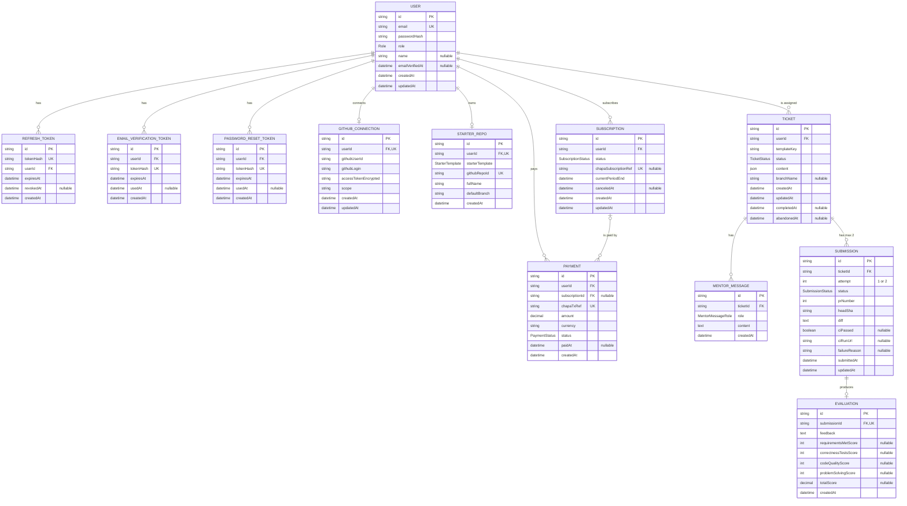

# 4. Database Requirements & ER Diagram

Project: Work Simulator · Links back to: [3. Use Cases]

This becomes `prisma/schema.prisma` almost line for line, so it is written as Prisma-style tables first. Anything the attached docs did not settle is listed in 4.6 (assumptions) or 4.7 (open questions) instead of being decided silently.

**Decisions this doc is built on** (locked or confirmed with the team):
- `User.id` is a UUID string; `User.role` is an existing enum
- `name` and `emailVerifiedAt` are added to the built `User` model (FR-01, FR-13, FR-05, FR-06)
- One GitHub repo per user, created from a starter template (React or Node/Express); each ticket is a branch/PR in that repo
- Team-authored ticket templates live as files in the codebase; the DB stores only a template key on each ticket
- Ticket status enum is exactly `assigned, in_progress, submitted_v1, resubmitted, done, abandoned`. There is no `scored` state: the score is stored on the evaluation record. This changes FR-33 in doc 2 (see 4.9)
- Two-pass flow: first submission = feedback only, resubmission = final score
- Subscription stores only Chapa references, never card or payment details (FR-17), and is confirmed only by a verified webhook (FR-18, FR-19)
- Rubric weights are fixed: 40 / 25 / 20 / 15
- Django starter template is unconfirmed, so it is not in the V1 schema. "Voxide" is still undefined, so it has no entity (FR-53)

**Source note:** only doc 2 (requirements) was available while writing this. Entities and V2 notes come from doc 2 plus the locked decisions. This doc does not reference `UC-##` numbers. Verify the entity list against docs 1 and 3 before treating it as final (A-01).

---

## 4.1 Entity List

| Entity | Purpose | Serves |
|---|---|---|
| User | A registered person; owns everything below (extends the built model) | FR-01 – FR-13 |
| RefreshToken | Hashed refresh token, one per session (already built, unchanged) | FR-04, FR-10, FR-11 |
| EmailVerificationToken | One-time email verification link | FR-05, FR-06 |
| PasswordResetToken | One-time password reset link | FR-07, FR-08 |
| GitHubConnection | The user's GitHub OAuth link (token + account identity) | FR-25, FR-26, FR-29 |
| StarterRepo | The single repo created for the user from a starter template | FR-27, FR-28 |
| Subscription | Chapa subscription state and paid-access window | FR-15, FR-20, FR-21, FR-22 |
| Payment | One row per Chapa payment attempt; also the billing history | FR-16 – FR-19, FR-22, FR-23 |
| Ticket | One assigned ticket and its lifecycle state | FR-30 – FR-36 |
| MentorMessage | One message in a ticket's mentor conversation | FR-37 – FR-41 |
| Submission | One submission pass (attempt 1 or 2): diff + CI result | FR-42 – FR-45, FR-43, FR-49 |
| Evaluation | Evaluator output for one submission: feedback, and the rubric score on pass 2 | FR-40, FR-44, FR-46 – FR-48 |

**Requirements with no table of their own:**
- FR-09, FR-10, FR-11: only update `RefreshToken.revokedAt` and `User.passwordHash`.
- FR-41: the per-ticket mentor rate limit is computed from `MentorMessage` rows.
- FR-50, FR-51: the profile page is derived from `Ticket`, `Submission` and `Evaluation`; the "practice record" label is UI text.
- FR-53 ("Voxide"): unresolved, so no entity exists for it.

---

## 4.2 Entity Detail

Notation: `Type?` means nullable. "As built" means the field already exists in production and is not redesigned here. Constraints on built models beyond what the project brief states are marked "as built" and must be checked against the real `schema.prisma` (A-02).

### 4.2.1 Enums

| Enum | Values | Notes |
|---|---|---|
| `Role` | as built | Existing enum on `User.role`. Name and values are not restated here (A-02) |
| `TicketStatus` | `assigned`, `in_progress`, `submitted_v1`, `resubmitted`, `done`, `abandoned` | Matches the locked state machine. `abandoned` is reachable only from `assigned` or `in_progress` |
| `SubscriptionStatus` | `active`, `past_due`, `canceled` | Matches FR-20 |
| `PaymentStatus` | `pending`, `succeeded`, `failed` | `pending` = checkout started, webhook not yet received |
| `StarterTemplate` | `react`, `node_express` | Django is unconfirmed and deliberately absent |
| `SubmissionStatus` | `awaiting_ci`, `evaluating`, `completed`, `failed` | `failed` = a pipeline error (GitHub Actions or evaluator call), which drives the retry state in FR-49 |
| `MentorMessageRole` | `user`, `mentor` | |

### 4.2.2 User (extends the built model)

| Field | Type | Constraints | Notes |
|---|---|---|---|
| id | String (UUID) | PK, default `uuid()` | As built |
| email | String | unique, required | As built |
| passwordHash | String | required | As built. bcrypt hash; never returned or logged |
| role | Role | required | As built |
| name | String? | nullable at DB level | **New.** FR-01, FR-13. Required at registration by API validation; nullable in the DB because existing rows have no name (A-03) |
| emailVerifiedAt | DateTime? | nullable | **New.** `null` = not verified. FR-05, FR-06 (A-04) |
| createdAt | DateTime | default `now()` | As built |
| updatedAt | DateTime | `@updatedAt` | As built |

### 4.2.3 RefreshToken (already built, unchanged)

| Field | Type | Constraints | Notes |
|---|---|---|---|
| id | String | PK | As built (assumed UUID like `User.id`; verify) |
| tokenHash | String | unique, required | As built. Hashed, never the raw token |
| userId | String | FK → User.id, required | As built |
| expiresAt | DateTime | required | As built |
| revokedAt | DateTime? | nullable | As built. Set on logout / log-out-everywhere (FR-10, FR-11) |
| createdAt | DateTime | default `now()` | As built |

### 4.2.4 EmailVerificationToken

| Field | Type | Constraints | Notes |
|---|---|---|---|
| id | String (UUID) | PK, default `uuid()` | |
| userId | String | FK → User.id, required | |
| tokenHash | String | unique, required | Hashed, same pattern as `RefreshToken` |
| expiresAt | DateTime | required | Expired link shows "expired" and offers resend (FR-06) |
| usedAt | DateTime? | nullable | Set when consumed; a used link shows "used" (FR-06) |
| createdAt | DateTime | default `now()` | |

### 4.2.5 PasswordResetToken

| Field | Type | Constraints | Notes |
|---|---|---|---|
| id | String (UUID) | PK, default `uuid()` | |
| userId | String | FK → User.id, required | |
| tokenHash | String | unique, required | Hashed |
| expiresAt | DateTime | required | Fixed window, e.g. 1 hour (FR-07) |
| usedAt | DateTime? | nullable | One-time-use: a token with `usedAt` set must be rejected (FR-08) |
| createdAt | DateTime | default `now()` | |

### 4.2.6 GitHubConnection

| Field | Type | Constraints | Notes |
|---|---|---|---|
| id | String (UUID) | PK, default `uuid()` | |
| userId | String | FK → User.id, unique, required | Unique = at most one connection per user |
| githubUserId | String | required | GitHub's numeric account ID stored as a string. Not unique (A-08) |
| githubLogin | String | required | GitHub username, shown in the UI |
| accessTokenEncrypted | String | required | Encrypted at rest; never logged (A-06) |
| scope | String | required | Scope string GitHub granted, kept so "repo create + push only" (FR-25) can be checked |
| createdAt | DateTime | default `now()` | |
| updatedAt | DateTime | `@updatedAt` | |

A row existing means "connected". Disconnecting (FR-26) or discovering a revoked token (FR-29) deletes the row (A-07).

### 4.2.7 StarterRepo

| Field | Type | Constraints | Notes |
|---|---|---|---|
| id | String (UUID) | PK, default `uuid()` | |
| userId | String | FK → User.id, unique, required | One repo per user (confirmed) |
| starterTemplate | StarterTemplate | required | Chosen once, at first ticket (FR-27) |
| githubRepoId | String | unique, required | GitHub's repo ID as a string |
| fullName | String | required | `owner/name` |
| defaultBranch | String | required | Base branch for ticket PRs |
| createdAt | DateTime | default `now()` | |

Kept separate from `GitHubConnection` so the repo record survives a disconnect (FR-26: past submissions are not deleted).

### 4.2.8 Subscription

| Field | Type | Constraints | Notes |
|---|---|---|---|
| id | String (UUID) | PK, default `uuid()` | |
| userId | String | FK → User.id, required | Not unique: a user can have several over time (A-15) |
| status | SubscriptionStatus | required | |
| chapaSubscriptionRef | String? | unique, nullable | Chapa reference only, no card data (FR-17). Nullable because it is not settled whether Chapa issues a subscription-level ID (Q-05) |
| currentPeriodEnd | DateTime | required | Next billing date (FR-20) and the end of paid access (FR-21) |
| canceledAt | DateTime? | nullable | Set when the user cancels; access continues until `currentPeriodEnd` |
| createdAt | DateTime | default `now()` | |
| updatedAt | DateTime | `@updatedAt` | |

A `Subscription` row is created only after the webhook confirms the first payment (FR-18). Before that, only a `Payment` with status `pending` exists.

### 4.2.9 Payment

| Field | Type | Constraints | Notes |
|---|---|---|---|
| id | String (UUID) | PK, default `uuid()` | |
| userId | String | FK → User.id, required | |
| subscriptionId | String? | FK → Subscription.id, nullable | `null` until the webhook confirms and the subscription exists |
| chapaTxRef | String | unique, required | Chapa transaction reference; how a webhook is matched to a payment. Unique so a repeated webhook cannot create a second record |
| amount | Decimal(12,2) | required | |
| currency | String | required | Stored, not assumed |
| status | PaymentStatus | default `pending` | |
| paidAt | DateTime? | nullable | Set when the webhook confirms |
| createdAt | DateTime | default `now()` | |

Payment history (FR-23) is this table. No card numbers, tokens or other payment details are stored (FR-17).

### 4.2.10 Ticket

| Field | Type | Constraints | Notes |
|---|---|---|---|
| id | String (UUID) | PK, default `uuid()` | |
| userId | String | FK → User.id, required | |
| templateKey | String | required | Key of a team-authored template file in the codebase. Not a FK (A-10) |
| status | TicketStatus | required, default `assigned` | Enum, not a free string |
| content | Json | required | Snapshot of the ticket as shown to the user: title, scenario, acceptance criteria, test checklist, plus category/difficulty/touched files copied from the template at assignment. Exact shape belongs to doc 5 (A-10) |
| branchName | String? | nullable | The ticket's branch in the user's repo. Nullable because who creates the branch is unsettled (Q-02) |
| createdAt | DateTime | default `now()` | Time of assignment |
| updatedAt | DateTime | `@updatedAt` | |
| completedAt | DateTime? | nullable | Set when status becomes `done` |
| abandonedAt | DateTime? | nullable | Set when status becomes `abandoned` |

### 4.2.11 MentorMessage

| Field | Type | Constraints | Notes |
|---|---|---|---|
| id | String (UUID) | PK, default `uuid()` | |
| ticketId | String | FK → Ticket.id, required | Every message belongs to exactly one ticket |
| role | MentorMessageRole | required | |
| content | String (`@db.Text`) | required | |
| createdAt | DateTime | default `now()` | Ordering key for the transcript (A-18) |

The full transcript is retained and readable (FR-39) and passed to the evaluator (FR-40).

### 4.2.12 Submission

| Field | Type | Constraints | Notes |
|---|---|---|---|
| id | String (UUID) | PK, default `uuid()` | |
| ticketId | String | FK → Ticket.id, required | |
| attempt | Int | required, `1` or `2` | 1 = first submission (feedback only), 2 = resubmission (scored) |
| status | SubmissionStatus | default `awaiting_ci` | Tracks the pipeline, including the failure/retry state (FR-49) |
| prNumber | Int | required | PR number in the user's repo |
| headSha | String | required | Commit that was evaluated |
| diff | String (`@db.Text`) | required | Stored so the diff stays viewable if the PR is later force-pushed or deleted (FR-36, FR-50) (A-13) |
| ciPassed | Boolean? | nullable | `null` until GitHub Actions finishes; then pass/fail of the starter template's tests (FR-43) |
| ciRunUrl | String? | nullable | Link to the Actions run |
| failureReason | String? | nullable | Set when `status = failed` |
| submittedAt | DateTime | default `now()` | |
| updatedAt | DateTime | `@updatedAt` | |

### 4.2.13 Evaluation

| Field | Type | Constraints | Notes |
|---|---|---|---|
| id | String (UUID) | PK, default `uuid()` | |
| submissionId | String | FK → Submission.id, unique, required | One evaluation per submission |
| feedback | String (`@db.Text`) | required | Given on both passes (A-14) |
| requirementsMetScore | Int? | nullable, 0–100 | Rubric category, weight 40% |
| correctnessTestsScore | Int? | nullable, 0–100 | Rubric category, weight 25% |
| codeQualityScore | Int? | nullable, 0–100 | Rubric category, weight 20% |
| problemSolvingScore | Int? | nullable, 0–100 | Rubric category, weight 15%. Scored from the mentor transcript |
| totalScore | Decimal(5,2)? | nullable, 0–100 | Weighted total, stored so it never shifts if code changes |
| createdAt | DateTime | default `now()` | |

The five score fields are all `null` on attempt 1 and all filled on attempt 2 (DR-04, DR-05). The weights (40/25/20/15) are applied in code and are not stored (A-14).

---

## 4.3 Relationships and ER Diagram

### 4.3.1 Relationships

| From | To | Cardinality | Enforced by |
|---|---|---|---|
| User | RefreshToken | 1 : many | `RefreshToken.userId` (as built) |
| User | EmailVerificationToken | 1 : many | `EmailVerificationToken.userId` |
| User | PasswordResetToken | 1 : many | `PasswordResetToken.userId` |
| User | GitHubConnection | 1 : 0..1 | `GitHubConnection.userId` unique |
| User | StarterRepo | 1 : 0..1 | `StarterRepo.userId` unique |
| User | Subscription | 1 : many (history) | `Subscription.userId`; at most one `active`/`past_due` row (DR-02) |
| User | Payment | 1 : many | `Payment.userId` |
| Subscription | Payment | 1 : many | `Payment.subscriptionId` (nullable) |
| User | Ticket | 1 : many | `Ticket.userId`; at most one active ticket (DR-01) |
| Ticket | MentorMessage | 1 : many | `MentorMessage.ticketId` |
| Ticket | Submission | 1 : 0..2 | `Submission.ticketId`, unique with `attempt` (DR-03) |
| Submission | Evaluation | 1 : 0..1 | `Evaluation.submissionId` unique |

There is deliberately no direct `Ticket` → `StarterRepo` link. With one repo per user, the repo is reached through `Ticket.userId` → `StarterRepo.userId`.

### 4.3.2 ER diagram

---

## 4.4 Indexes & Constraints Beyond the Obvious

These are numbered `DR-##` so later docs and tests can reference them. Prisma cannot express partial unique indexes or CHECK constraints, so DR-01 to DR-04 must be added as hand-written SQL in the migration (see 4.5).

| ID | Requirement | Serves | How |
|---|---|---|---|
| DR-01 | A user has at most one active ticket. "Active" = any status except `done` and `abandoned` (so `submitted_v1` and `resubmitted` count as active) | FR-30, FR-34 | Partial unique index on `Ticket(userId)` where `status NOT IN ('done','abandoned')` |
| DR-02 | A user has at most one subscription in `active` or `past_due` | FR-15, FR-20 | Partial unique index on `Subscription(userId)` where `status IN ('active','past_due')`. `canceled` rows are unrestricted |
| DR-03 | A ticket has at most one submission per attempt, and attempts are only 1 or 2 | FR-44, FR-46 | `@@unique([ticketId, attempt])` plus `CHECK (attempt IN (1,2))` |
| DR-04 | Score fields are all null or all filled, and each is in range (categories 0–100, total 0–100) | FR-46, FR-47 | `CHECK` constraints on `Evaluation` |
| DR-05 | Score fields are filled only when the linked submission has `attempt = 2` | FR-44, FR-46 | Cross-table rule, so enforced in application code and covered by a test, not by a DB constraint |
| DR-06 | A repeated Chapa webhook must not create a second payment or extend the period twice | FR-18, FR-19 | `Payment.chapaTxRef` unique; the handler checks the current `Payment.status` before applying a change |
| DR-07 | No raw card or payment data in any table | FR-17 | Schema review rule: only `chapaTxRef` and `chapaSubscriptionRef` are allowed |
| DR-08 | No deletes and no soft-delete in V1. All new relations use `onDelete: Restrict` | Data retention (doc 2, 2.2), FR-14 | Explicit `onDelete: Restrict` on every new relation. The `RefreshToken` relation stays as built. The one exception is the `GitHubConnection` row, which is deleted on disconnect (A-07) |
| DR-09 | Ticket branch names are unique per user when set | FR-27 | `@@unique([userId, branchName])`. Postgres allows multiple `null` values |
| DR-10 | Supporting indexes for the known queries | FR-20, FR-23, FR-39, FR-50 | `Ticket(userId, status)`, `Subscription(userId, status)`, `Payment(userId, createdAt)`, `MentorMessage(ticketId, createdAt)` |

Abandoned tickets and their mentor messages are kept (DR-08). Only completed tickets appear on the profile.

---

## 4.5 Migration Notes

1. **This is an additive migration on a live database.** `User` and `RefreshToken` already exist in production. The migration adds two columns to `User`, the enums, and the new tables. It changes no existing column.
2. **`User.name` is nullable at the DB level** because existing rows have no name. Registration validation (FR-01) requires it. Making it required later needs its own migration after a backfill.
3. **Existing users have `emailVerifiedAt = null`.** Decide before shipping whether to backfill existing users as verified. Otherwise anything that later gates on verification locks them out (Q-04).
4. **Foreign key types must match `User.id` exactly.** If the built model uses `@db.Uuid` on `id`, every new `userId` column needs `@db.Uuid` too, or the FK will fail to create.
5. **Partial unique indexes and CHECK constraints (DR-01 to DR-04)** cannot be written in Prisma schema. Run `prisma migrate dev --create-only`, add the SQL by hand to the generated migration file, then apply it. After that, read the generated SQL of every later `migrate dev` to confirm it is not trying to drop these.
6. **No seed data is required.** Ticket templates live in the codebase, so nothing needs to be inserted for the app to work.
7. **Recommendation, not a project requirement:** `schema.prisma` is one file shared by five people. Have one person own schema changes during the 20 days to avoid conflicting migrations.

---

## 4.6 Assumptions

Each assumption is one the attached docs do not settle. Correct any that are wrong before doc 5 is written.

| ID | Assumption | Where it matters |
|---|---|---|
| A-01 | Docs 1 (problem/solution) and 3 (use cases) were not available. The entity list and V2 notes come from doc 2 and the locked decisions only | Whole doc |
| A-02 | The built `Role` enum's name and values are not restated. Constraints on built models beyond the project brief are marked "as built" and need checking against the real file | 4.2.1, 4.2.2, 4.2.3 |
| A-03 | Production `User` rows exist, so `name` is nullable in the DB and required only by API validation | `User.name` |
| A-04 | `emailVerifiedAt = null` means unverified. Doc 2 does not say what an unverified user may or may not do, so no schema depends on it | `User.emailVerifiedAt` |
| A-05 | Verification and reset tokens are two separate tables, both hashed like `RefreshToken`, with `usedAt` for one-time use | 4.2.4, 4.2.5 |
| A-06 | The GitHub token is stored encrypted at rest (doc 2 says "never logged" but not "encrypted"). No refresh-token fields exist, which assumes a token that does not expire unless revoked. If the team uses an expiring-token GitHub integration, add refresh and expiry fields | `GitHubConnection` |
| A-07 | A `GitHubConnection` row existing means "connected". Disconnecting or detecting a revoked token deletes the row. Repo and submission records survive | FR-26, FR-29 |
| A-08 | `githubUserId` is not unique, so one GitHub account can be linked to more than one platform account | `GitHubConnection` |
| A-09 | The starter template is chosen once per user, when the repo is created. Changing it afterwards is not supported in V1 | `StarterRepo` |
| A-10 | Template **structure** lives in code, but the AI-written wording for a specific ticket is per-ticket data. It is stored as a snapshot in `Ticket.content`, because generation is not repeatable and past tickets must stay viewable (FR-36). This goes one step beyond "the DB stores only a template key" | `Ticket.content` |
| A-11 | Abandoning keeps the row with status `abandoned` and issues a new ticket (see 4.9 for the FR-35 wording change) | `Ticket` |
| A-12 | Exactly two submission attempts per ticket. A pipeline error sets `status = failed` on the same row, and a retry re-runs it. A retry is not a new attempt | `Submission` |
| A-13 | The full diff text is stored in the DB, not just the PR link | `Submission.diff` |
| A-14 | One `Evaluation` per `Submission`, not per ticket, so the pass-1 feedback has a home. Scores are null on pass 1. Feedback text is required on both passes. Category scores are 0–100. The weighted total is stored as a decimal, with weights applied in code | `Evaluation` |
| A-15 | A `Subscription` row exists only after the webhook confirms the first payment, and a re-subscribe after canceling creates a new row. Cancel sets `status = canceled` immediately and records `canceledAt`. Access is granted when status is `active`, or when status is `canceled` and `currentPeriodEnd` is in the future | `Subscription`, `Payment` |
| A-16 | Amounts are stored as `Decimal(12,2)` with a `currency` column. No currency is assumed | `Payment` |
| A-17 | Webhook events are logged (per doc 2, 2.2), not stored in their own table | Observability |
| A-18 | Transcript order is `MentorMessage.createdAt` (millisecond precision). No separate sequence column | `MentorMessage` |

---

## 4.7 Open Questions

The schema above works whichever way these go, but the answers change behavior in doc 5 and in the code.

| ID | Question | Affects |
|---|---|---|
| Q-01 | How long is the `past_due` grace period, and does `past_due` still grant access? FR-22 says access is not cut "immediately" but gives no length | Access rule in A-15 |
| Q-02 | Who creates the ticket branch and PR: the platform at assignment, or the user? | `Ticket.branchName` (nullable until answered) |
| Q-03 | If a user reconnects GitHub as a different account than the one that owns their repo, what happens? | `StarterRepo`, `GitHubConnection` |
| Q-04 | Does email verification block anything (subscribing, starting a ticket)? Are existing users backfilled as verified? | `User.emailVerifiedAt` |
| Q-05 | Does Chapa's recurring billing give a subscription-level reference, or only per-charge transaction references? Does Chapa or the platform trigger each monthly charge? | `Subscription.chapaSubscriptionRef`, webhook handling |
| Q-06 | Is there a size limit on a stored diff, and what happens above it? | `Submission.diff` |

---

## 4.8 V2 / V3 Extension Points

One sentence per entity, limited to what doc 2 marks as deferred. Nothing here is built in V1. V3 is not described in any attached doc, so it is not covered (A-01).

- **User:** public/shareable profile links (FR-52) can be added as a new nullable column or a new table keyed on `User.id`, and self-service account deletion (FR-14) can later be added as a delete policy change or a `deletedAt` column, since V1 code relies on neither.
- **Ticket:** streaks and leaderboards can be computed from `completedAt`, which V1 already stores, and a new ticket template or category needs no migration because `templateKey` is a plain string.
- **StarterRepo:** adding Django (unconfirmed) is a one-line addition to the `StarterTemplate` enum.
- **Subscription / Payment:** in-app self-service refunds (FR-24) can be added as nullable refund fields or a new table without changing existing rows.
- **Submission / Evaluation:** `attempt` is an integer rather than a boolean, so if a later version makes scoring iterative, the change is relaxing the `CHECK` in DR-03 and DR-05 rather than restructuring these tables.
- **Notifications (deferred, see 2.3):** async product notifications would be a new table alongside `User`, with no change to existing tables.

---

## 4.9 Changes to Doc 2

Numbering is not changed. These are wording amendments, made because the locked state machine differs from doc 2.

- **FR-33:** replace the state list with `assigned → in_progress → submitted_v1 → resubmitted → done`, plus `abandoned` (reachable only from `assigned` or `in_progress`). The `scored` state is removed. The score is stored on `Evaluation` (4.2.13). FR-48 still holds: on a scored resubmission the ticket moves to `done`.
- **FR-35:** "which resets it" becomes "which marks it `abandoned` (the row is kept) and immediately issues a new one".
- **FR-36:** retention also applies to `abandoned` tickets and their mentor history, though only `done` tickets appear on the profile.

---

*Numbering convention: FR-01, FR-02... (doc 2), `UC-##` (doc 3), `DR-##`, `A-##` and `Q-##` (this doc) each form one continuous sequence across the whole series. Never renumber once used. If an item is dropped, mark it `~~DR-XX~~ (deprecated, see DR-YY)` instead.*

Next: proceed to → [5. API Specification]
