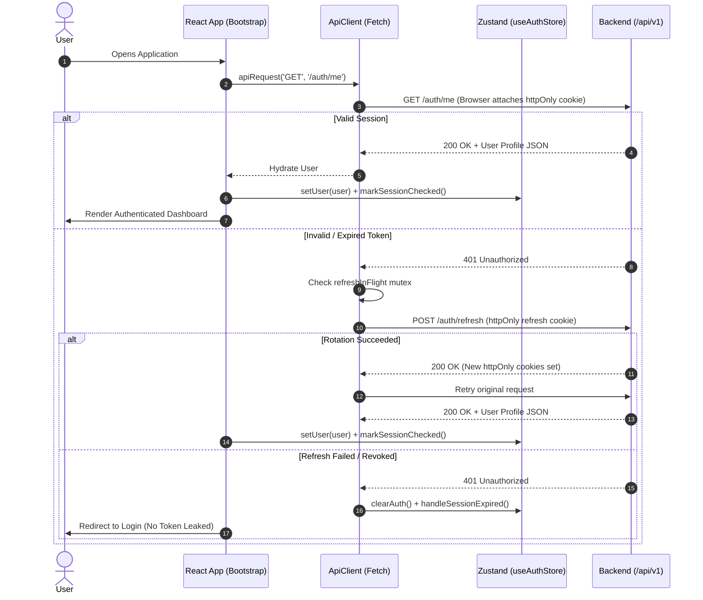
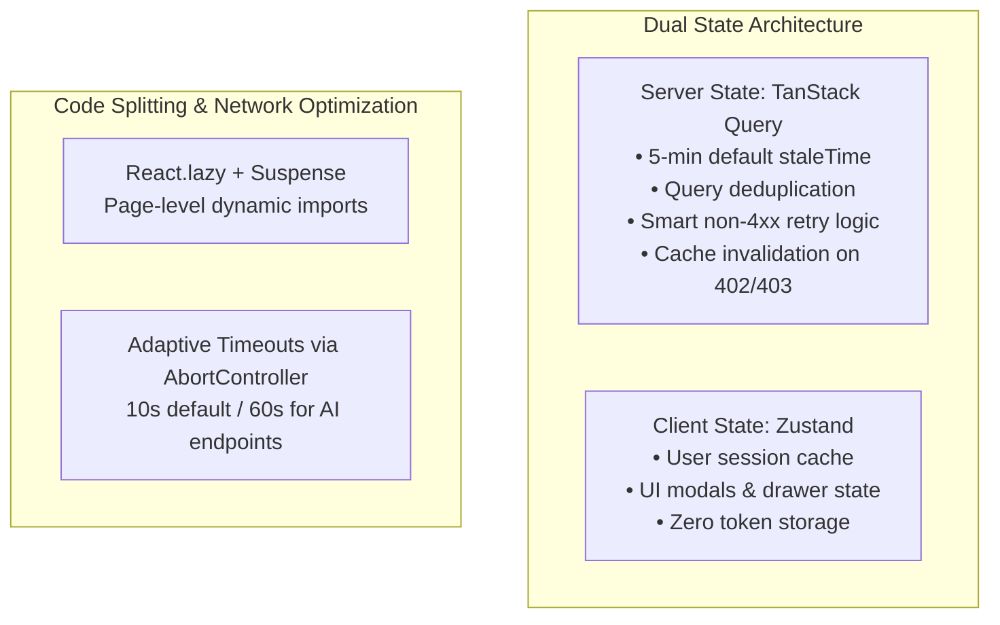

# ⚛️ Work Simulator — Frontend Client

> **A high-performance, accessible, and secure Single Page Application (SPA) simulating real software engineering workflows.**  
> Built with React 19, Vite, TypeScript, Tailwind CSS v4, shadcn/ui, TanStack Query v5, and Zustand.

---

[](https://react.dev/)
[](https://vitejs.dev/)
[](https://www.typescriptlang.org/)
[](https://tailwindcss.com/)
[](https://tanstack.com/query)
[](https://github.com/pmndrs/zustand)
[](../LICENSE)

---

## 📖 Overview

The Work Simulator Frontend is the primary interface for junior software developers. It provides an authentic corporate developer experience featuring:
- **Guided Authentication & Verification Flow:** Registration, email verification, and password recovery.
- **Subscription Checkout & Billing Management:** Seamless integration with Chapa hosted checkouts.
- **GitHub OAuth & Repository Hub:** Connect personal GitHub accounts and spin up starter repositories across multiple tech tracks.
- **Interactive Ticket Workspace:** Detailed ticket views, acceptance criteria, touched files, and test checklists.
- **Real-Time Senior AI Mentorship:** Progressive 4-stage hint console with adaptive guidance.
- **Pull Request & Evaluation Center:** Real-time CI test tracking, structured code review feedback, and multi-dimensional rubric score visualizations.
- **Verified Experience Portfolio:** Visual metrics, historical submissions, and performance radar charts powered by Recharts.

---

## 🛠 Tech Stack

| Layer | Technology | Purpose |
|---|---|---|
| **Framework & Core** | React 19, TypeScript, Vite 8 | Ultra-fast HMR, strict type safety, modern concurrent rendering |
| **Styling & UI** | Tailwind CSS v4, shadcn/ui, Radix UI | Headless accessible components with zero runtime CSS overhead |
| **Typography** | Geist Sans & Fraunces Variable | High-legibility technical typography |
| **Server State** | TanStack Query v5 | Data fetching, background caching, query deduplication, optimistic updates |
| **Client State** | Zustand v5 | Lightweight UI state, transient authentication cache |
| **Routing** | React Router v7 | Dynamic client-side routing with lazy-loaded route chunks |
| **Forms & Validation** | React Hook Form, Zod | Type-safe form controls with client-side schema validation |
| **Data Visualization**| Recharts | Interactive rubric scoring distributions and analytics |
| **Voice Layer** | @voxide/react | Native voice command SDK for hands-free workflow actions |
| **Testing** | Vitest, React Testing Library, jsdom | Isolated unit and component integration testing |

---

## 🛡️ Security Architecture

The frontend is architected around a **Zero-Trust Token Model**, prioritizing resistance against Cross-Site Scripting (XSS) and Cross-Site Request Forgery (CSRF).



### 1. Zero-Token Client (Total XSS Immunity)
- **No Local Storage Tokens:** Unlike typical SPAs that persist JWTs in `localStorage` or `sessionStorage` (which are completely vulnerable to exfiltration by injected XSS scripts), this application **never stores raw tokens in JavaScript**.
- **httpOnly Cookie Propagation:** Tokens are stored in browser-enforced `httpOnly` cookies managed exclusively by the browser and the backend API.
- The Zustand store (`useAuthStore`) caches only non-sensitive public user metadata (`id`, `email`, `name`, `role`) for instantaneous UI rendering.

### 2. Session Bootstrap & Flash-Free Hydration
- On initial page load, `useSessionBootstrap` dispatches a `GET /auth/me` request with `credentials: 'include'`.
- The router view remains gated behind `isSessionChecked`, preventing embarrassing UI flashes where authenticated users momentarily see a login page during hard refreshes.

### 3. Single-Flight Token Refresh Mutex (`refreshInFlight`)
- Located in `src/lib/api/client.ts`, the custom `apiRequest` client features an atomic promise mutex.
- When multiple parallel requests encounter an expired access token (`401 Unauthorized`):
  1. Only the first request triggers `POST /auth/refresh`.
  2. Concurrent requests await the pending `refreshInFlight` promise.
  3. Once refreshed, all queued requests replay automatically without triggering multiple conflicting refresh token rotations.
- If the refresh token is expired or revoked, `handleSessionExpired()` cleans local cache state and redirects cleanly to login.

### 4. Strict Environment Validation (Zod Guard)
- Environment variables are strictly validated at runtime in `src/config/env.ts` before any component mounts:
  ```ts
  const envSchema = z.object({
    VITE_API_URL: z.string().url(),
    VITE_APP_NAME: z.string().default('App'),
    VITE_APP_ENV: z.enum(['development', 'production']).default('development'),
  });
  ```
- Direct access to `import.meta.env` is restricted across the application to guarantee that configuration errors fail fast during build and boot phases.

### 5. Client-Side Input Sanitization & Zod Resolvers
- Every form (registration, password reset, ticket actions) uses React Hook Form with Zod schemas matching the backend contracts, validating constraints before network requests dispatch.

---

## ⚡ Performance & Efficiency Architecture



### 1. Dual-Tier State Architecture
- **Server State (TanStack Query v5):**
  - All API data (tickets, mentor transcripts, submissions, billing status) is managed via TanStack Query.
  - Configured with a 5-minute `staleTime`, eliminating redundant HTTP calls on tab navigation.
  - Automatic query deduplication ensures identical simultaneous components share a single inflight request.
  - Global error listeners in `src/lib/queryClient.ts` monitor for status codes: automatically invalidating `subscription` cache on `402 Payment Required` and `githubConnection` cache on `403 Forbidden`.
- **Client State (Zustand v5):**
  - Dedicated strictly to transient UI state (e.g. sidebar collapse, active modals, session check state). Keeps memory overhead lightweight and predictable.

### 2. Intelligent Query Retry Logic
- Retrying requests that failed due to validation or permission errors wastes client resources and server bandwidth.
- `shouldRetryQuery` explicitly prohibits retrying:
  - Any 4xx client error (`400`, `401`, `403`, `404`, `409`, `422`).
  - Aborted requests (`AbortError`, `CanceledError`, `ERR_CANCELED`).
- It permits a single retry only on genuine network disconnects or 5xx server faults.

### 3. Adaptive Request Timeouts via `AbortController`
- The API client dynamically assigns timeouts depending on the operation:
  - Standard endpoints: 10,000ms (`REQUEST_TIMEOUT_DEFAULT_MS`).
  - Long-running AI operations (`/github/repo`, `/tickets`, `/mentor/messages`, `/submissions`): 60,000ms (`REQUEST_TIMEOUT_LONG_MS`).
- Requests seamlessly bind `AbortController` signals to cancel network activity if the user navigates away before completion.

### 4. Route-Level Code Splitting
- All top-level page components in `src/pages/` are lazy-loaded via `React.lazy()`:
  - Initial JavaScript bundle size is minimized.
  - Heavy graphing utilities (`recharts`) and voice SDKs (`@voxide/react`) are only downloaded when the corresponding dashboard views are loaded.

---

## 📁 Directory Structure

```text
frontend/src/
├── assets/             # Static SVGs, images, and brand marks
├── components/         # Reusable React components
│   ├── common/         # Breadcrumbs, status badges, error boundaries
│   ├── layouts/        # Shell layout, navbar, sidebar, auth containers
│   └── ui/             # shadcn/ui & Radix primitives (Button, Dialog, Input)
├── config/             # Zod environment schema & application constants
├── constants/          # Static configuration arrays and lookup tables
├── hooks/              # Custom React hooks (useSessionBootstrap, mutations)
├── lib/
│   ├── api/            # Custom fetch API client (single-flight refresh, ApiError)
│   ├── format.ts       # Date, currency, and diff formatting helpers
│   ├── github.ts       # GitHub branch and repository utilities
│   ├── navigation.ts   # Role-based route redirection logic
│   ├── query-keys.ts   # Structured TanStack Query key factory
│   ├── queryClient.ts  # TanStack QueryClient with smart retry & invalidation
│   ├── ticket-phase.ts # Ticket state machine and phase calculations
│   └── utils.ts        # Tailwind cn() class merge helper
├── pages/              # Lazy-loaded route views
│   ├── auth/           # Login, Register, VerifyEmail, ForgotPassword
│   ├── billing/        # Plans, Checkout, PaymentSuccess, PaymentFailed
│   ├── dashboard/      # Developer home, active ticket summary
│   ├── github/         # OAuth callback, repo creator, template selector
│   ├── profile/        # Work-sample portfolio, rubric score breakdowns
│   ├── settings/       # Account preferences & connection management
│   ├── submissions/    # PR submission tracker, CI logs, evaluator feedback
│   └── tickets/        # Ticket detail view, AI mentor chat interface
├── routes/             # React Router v7 routes and protection wrappers
├── schemas/            # Zod validation schemas for forms and payloads
├── store/              # Zustand state stores (auth.store.ts)
├── styles/             # Tailwind CSS v4 design tokens and base styles
├── types/              # Domain entities, API contracts, response envelopes
├── App.tsx             # Root component with QueryProvider and session gating
└── main.tsx            # Application entrypoint
```

---

## 🚀 Getting Started

### Prerequisites
- Node.js `>= 20.x` (or Node `>= 22.x` per `.nvmrc`)
- Monorepo backend running locally on `http://localhost:3000`

### 1. Installation
Install dependencies from the monorepo root:
```bash
# Recommended from repository root:
npm run install:all

# Or inside frontend/:
cd frontend
npm install
```

### 2. Configure Environment Variables
```bash
cp .env.example .env
```

Ensure your `.env` contains:
```env
VITE_API_URL=http://localhost:3000/api/v1
VITE_APP_NAME=Work Simulator
VITE_APP_ENV=development
```

### 3. Start Development Server
```bash
npm run dev
```
The application will launch at `http://localhost:5173`.

---

## 📜 Available Scripts

| Command | Action |
|---|---|
| `npm run dev` | Starts Vite local development server with HMR |
| `npm run build` | Runs TypeScript compilation (`tsc -b`) and generates production bundle |
| `npm run preview` | Serves the production build locally for verification |
| `npm run lint` | Runs ESLint across all `.ts` and `.tsx` source files |
| `npm run format` | Formats files according to Prettier rules |
| `npm run test` | Executes unit and component tests with Vitest |

---

## 🧪 Testing Strategy

The test suite mirrors the `src/` directory tree under `tests/`:

```bash
# Run tests in watch mode
npm run test

# Run tests with coverage report
npx vitest run --coverage
```

- **Unit Tests:** Validates helper functions, formatters, and phase calculations.
- **Hook Tests:** Tests `useSessionBootstrap`, query hooks, and Zustand store mutations.
- **Component Tests:** Utilizes `@testing-library/react` and `jsdom` to verify user interactions, access guards, and form validations.

---

## 📄 License

This frontend is open-source software licensed under the **[MIT License](../LICENSE)**.
